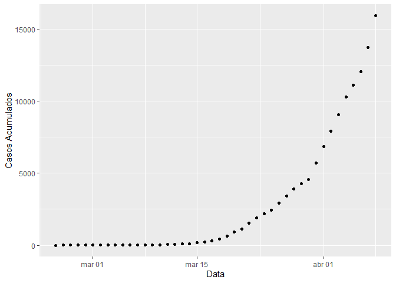
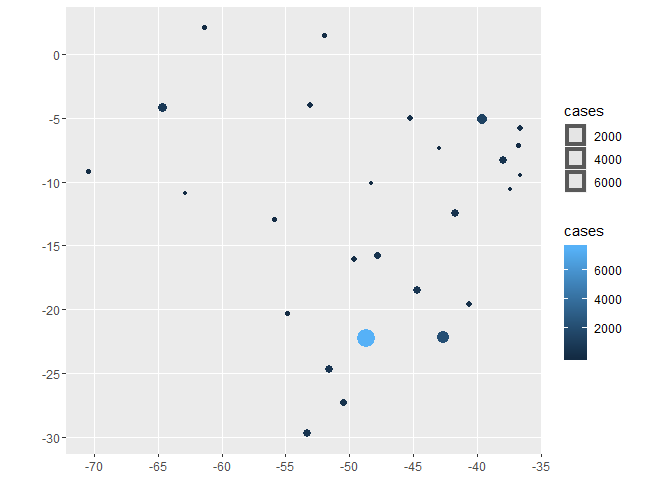
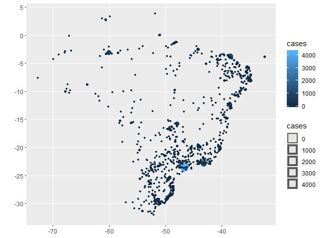

<!-- README.md is generated from README.Rmd. Please edit that file -->

# coronavirusbrazil

<!-- badges: start -->

[](https://www.tidyverse.org/lifecycle/#experimental)
[](https://opensource.org/licenses/MIT)
[](https://github.com/mralbu/coronavirusbrazil/commit/master)
<!-- badges: end -->

The coronavirusbrazil package provides a tidy format dataset of the 2019
Novel Coronavirus COVID-19 (2019-nCoV) epidemic for Brazil. The datasets
were obtained from
[RamiKrispin/coronavirus](https://github.com/RamiKrispin/coronavirus),
[Ministerio da Saúde](https://covid.saude.gov.br/),
[brasil.io](https://brasil.io/dataset/covid19/caso) and [Secretaria de
Saúde - RJ](http://painel.saude.rj.gov.br/monitoramento/covid19.html).

This repository was inspired by the
[RamiKrispin/coronavirus](https://github.com/RamiKrispin/coronavirus)
package repository.

## Installation

You can install the released version of coronavirusbrazil from
[CRAN](https://CRAN.R-project.org) with:

``` r
# install.packages("devtools")
devtools::install_github("mralbu/coronavirusbrazil")
```

## Usage

The package contains the following datasets:

``` r
library(coronavirusbrazil)
library(ggplot2)


data("coronavirus_br")
head(coronavirus_br) 
#> # A tibble: 6 x 10
#>   date       cases deaths new_cases new_deaths death_rate percent_case_in~
#>   <date>     <dbl>  <dbl>     <dbl>      <dbl>      <dbl>            <dbl>
#> 1 2020-02-25     0      0        NA         NA        NaN               NA
#> 2 2020-02-26     1      0         1          0          0              Inf
#> 3 2020-02-27     1      0         0          0          0                0
#> 4 2020-02-28     1      0         0          0          0                0
#> 5 2020-02-29     2      0         1          0          0              100
#> 6 2020-03-01     2      0         0          0          0                0
#> # ... with 3 more variables: percent_death_increase <dbl>, days_gt_10 <dbl>,
#> #   days_gt_100 <dbl>
```

``` r
plot_coronavirus(coronavirus_br, xaxis = "date", yaxis = "cases", log_scale = F, linear_smooth = F)
```



``` r
data("coronavirus_br_states")
head(coronavirus_br_states) 
#> # A tibble: 6 x 11
#> # Groups:   state [1]
#>   state date       cases deaths new_cases new_deaths death_rate percent_case_in~
#>   <chr> <date>     <dbl>  <dbl>     <dbl>      <dbl>      <dbl>            <dbl>
#> 1 RO    2020-02-25     0      0         0          0        NaN              NaN
#> 2 RO    2020-02-26     0      0         0          0        NaN              NaN
#> 3 RO    2020-02-27     0      0         0          0        NaN              NaN
#> 4 RO    2020-02-28     0      0         0          0        NaN              NaN
#> 5 RO    2020-02-29     0      0         0          0        NaN              NaN
#> 6 RO    2020-03-01     0      0         0          0        NaN              NaN
#> # ... with 3 more variables: percent_death_increase <dbl>, days_gt_10 <dbl>,
#> #   days_gt_100 <dbl>
```

``` r
plot_coronavirus(coronavirus_br_states, yaxis = "percent_case_increase", color = "state", filter_variable = "state", facet = "state", filter_values = c("RJ", "SP", "DF", "CE", "RS", "MG"), log_scale = TRUE, linear_smooth = TRUE)
```


``` r
data("coronavirus_br_cities")
head(coronavirus_br_cities) 
#> # A tibble: 6 x 17
#> # Groups:   city [2]
#>   city  date       state place_type cases deaths is_last estimated_popul~
#>   <chr> <date>     <chr> <chr>      <dbl>  <dbl> <lgl>              <dbl>
#> 1 Abae~ 2020-04-12 MG    city           1      0 TRUE               23237
#> 2 Abae~ 2020-03-31 PA    city           1      0 FALSE             157698
#> 3 Abae~ 2020-04-01 PA    city           1      0 FALSE             157698
#> 4 Abae~ 2020-04-02 PA    city           1      0 FALSE             157698
#> 5 Abae~ 2020-04-03 PA    city           1      0 FALSE             157698
#> 6 Abae~ 2020-04-04 PA    city           1      0 FALSE             157698
#> # ... with 9 more variables: city_ibge_code <dbl>,
#> #   confirmed_per_100k_inhabitants <dbl>, death_rate <dbl>, new_cases <dbl>,
#> #   new_deaths <dbl>, percent_case_increase <dbl>,
#> #   percent_death_increase <dbl>, days_gt_10 <dbl>, days_gt_100 <dbl>
```

There are also geospatial datasets avaiable:

``` r
dplyr::glimpse(spatial_br_states)
#> Observations: 27
#> Variables: 16
#> $ id                     <chr> "AC", "AL", "AM", "AP", "BA", "CE", "DF", "E...
#> $ name                   <chr> "Acre", "Alagoas", "Amazonas", "Amapá", "Bah...
#> $ uf                     <chr> "AC", "AL", "AM", "AP", "BA", "CE", "DF", "E...
#> $ codigo                 <int> 12, 27, 13, 16, 29, 23, 53, 32, 52, 21, 31, ...
#> $ regiao                 <chr> "Norte", "Nordeste", "Norte", "Norte", "Nord...
#> $ geometry               <list> [<-70.470805, -9.213489>, <-36.622412, -9.5...
#> $ date                   <date> 2020-04-12, 2020-04-12, 2020-04-12, 2020-04...
#> $ cases                  <dbl> 77, 48, 1206, 230, 673, 1676, 614, 383, 229,...
#> $ deaths                 <dbl> 2, 3, 62, 5, 21, 74, 14, 9, 14, 24, 20, 2, 3...
#> $ new_cases              <dbl> 5, 0, 156, 37, 38, 94, 35, 34, 20, 54, 56, 1...
#> $ new_deaths             <dbl> 0, 0, 9, 2, 0, 7, 0, 0, 4, 3, 3, 0, 0, 3, 2,...
#> $ death_rate             <dbl> 0.02597403, 0.06250000, 0.05140962, 0.021739...
#> $ percent_case_increase  <dbl> 6.944444, 0.000000, 14.857143, 19.170984, 5....
#> $ percent_death_increase <dbl> 0.000000, 0.000000, 16.981132, 66.666667, 0....
#> $ log_cases              <dbl> 1.886491, 1.681241, 3.081347, 2.361728, 2.82...
#> $ log_deaths             <dbl> 0.3010300, 0.4771213, 1.7923917, 0.6989700, ...
ggplot2::ggplot(spatial_br_states, ggplot2::aes(color=cases, size=cases)) + ggplot2::geom_sf()
```



``` r
dplyr::glimpse(spatial_br_cities)
#> Observations: 1,082
#> Variables: 7
#> $ date       <date> 2020-04-12, 2020-04-10, 2020-04-12, 2020-04-11, 2020-04...
#> $ city       <chr> "Abaeté", "Abaetetuba", "Abreu e Lima", "Açailândia", "A...
#> $ cases      <dbl> 1, 2, 10, 1, 9, 8, 0, 1, 1, 1, 1, 2, 1, 2, 5, 1, 1, 1, 2...
#> $ deaths     <dbl> 0, 0, 0, 0, 0, 0, 0, 1, 0, 1, 0, 0, 0, 1, 0, 0, 0, 0, 0,...
#> $ geometry   <POINT> POINT (-45.4444 -19.1551), POINT (-48.8788 -1.72183), ...
#> $ log_cases  <dbl> 0.0000000, 0.3010300, 1.0000000, 0.0000000, 0.9542425, 0...
#> $ log_deaths <dbl> -Inf, -Inf, -Inf, -Inf, -Inf, -Inf, -Inf, 0, -Inf, 0, -I...
ggplot2::ggplot(spatial_br_cities, ggplot2::aes(color=cases, size=cases)) + ggplot2::geom_sf()
```



# Data Sources

  - Countries:
    [RamiKrispin/coronavirus](https://github.com/RamiKrispin/coronavirus)
  - States: [Ministerio da Saúde](https://covid.saude.gov.br/)
  - Cities: [brasil.io](https://brasil.io/dataset/covid19/caso)
  - Rio de Janeiro: [Secretaria de Saúde -
    RJ](http://painel.saude.rj.gov.br/monitoramento/covid19.html)
